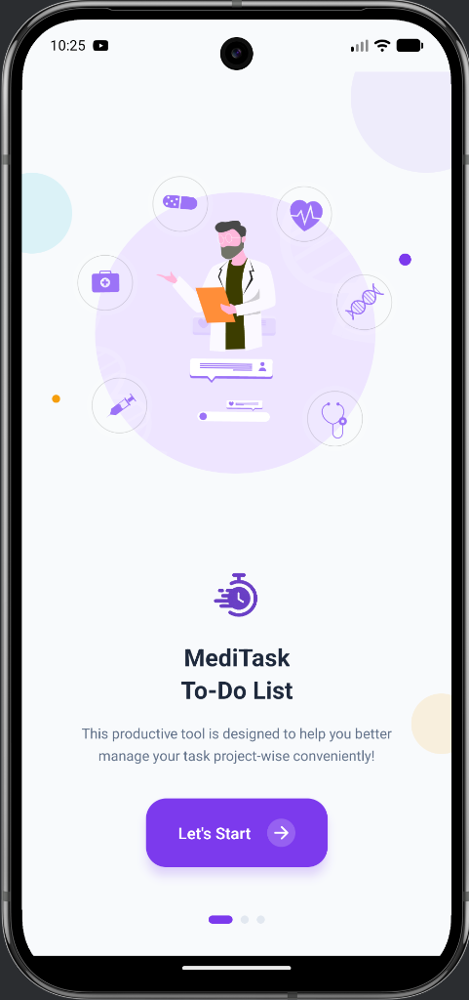
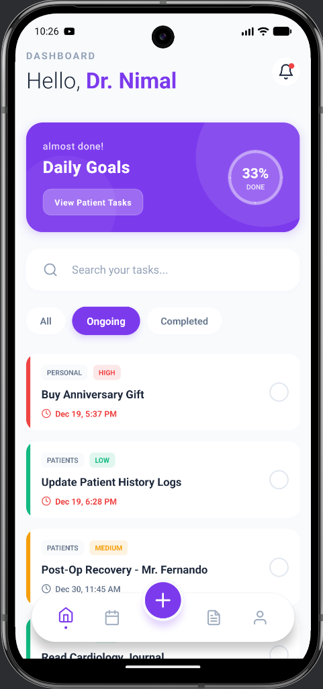
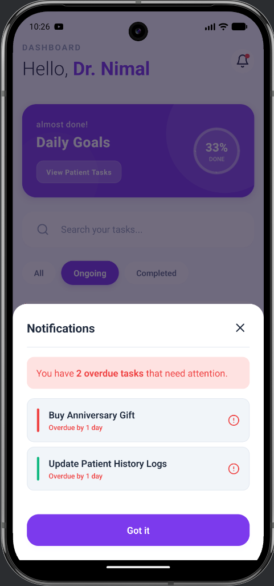
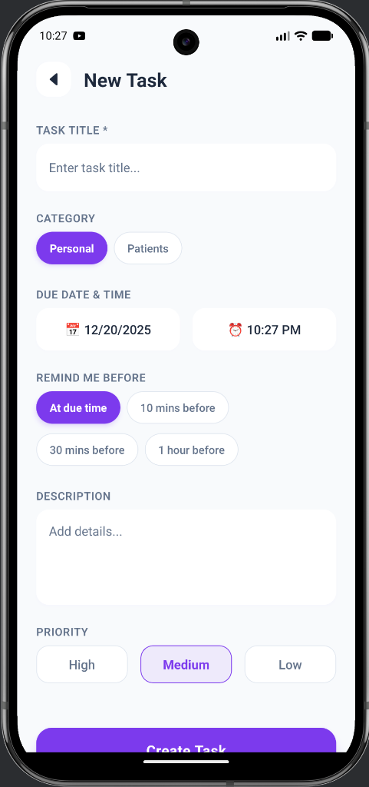
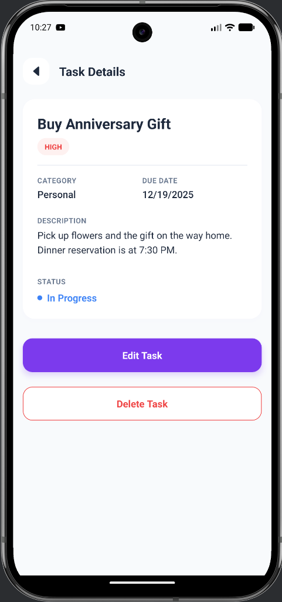

# 🏥 MediTask

**MediTask** is a specialized task management application designed for busy medical professionals. It helps doctors seamlessly manage both patient-related duties and personal commitments in one intuitive interface, ensuring no critical task is ever overlooked.

## � Screenshots

<p align="center">
  
  
  
  
  
</p>

## ✨ Features

- **Dual Category System**: Distinctly categorize tasks as **Patients** or **Personal** to keep your professional and private life organized but separated.
- **Smart Notifications**: Intelligent overdue task sorting that prioritizes the most critical and recent items first.
- **Dashboard Overview**: At-a-glance view of daily goals, progress tracking, and urgent tasks.
- **Detailed Analytics**: Weekly reports and completion statistics to track your productivity.
- **Priority Levels**: Assign High, Medium, or Low priority to tasks to focus on what matters most.
- **Secure & Local**: Data is stored locally on your device for privacy and speed.

## 🚀 Getting Started

### Prerequisites
- Node.js > 12 and npm
- React Native environment setup (Android Studio / Xcode)

### Installation

1. **Clone the repository**
   ```bash
   git clone https://github.com/RP1999/MediTask.git
   cd MediTask
   ```

2. **Install dependencies**
   ```bash
   npm install
   ```

3. **Run the application**
   
   *For Android:*
   ```bash
   npx react-native run-android
   ```
   
   *For iOS:*
   ```bash
   cd ios && pod install && cd ..
   npx react-native run-ios
   ```

## �️ Built With

- **React Native**: Core framework
- **AsyncStorage**: Local data persistence
- **React Native Push Notification**: Local scheduled notifications
- **Lottie**: High-quality animations

## 👨‍💻 Author

**Ranidu Pramod**
- GitHub: [@RP1999](https://github.com/RP1999)
- Email: promoranidu@gmail.com

## 🙏 Acknowledgments

- React Native community for excellent documentation.
- Designed with ❤️ for the medical community.

*Last Updated: December 2025*
